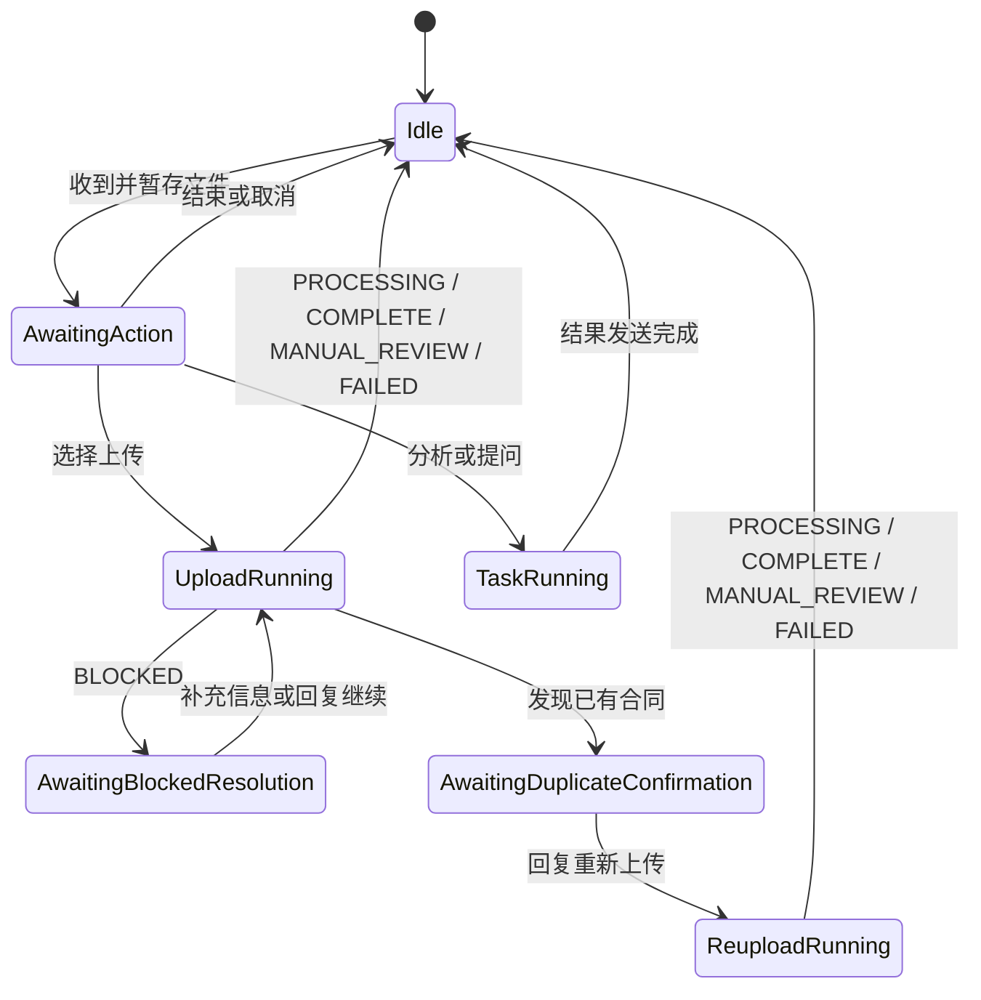

# 合同文件接收与路由 0.5.9

本插件把企业微信文件事件转换为可恢复的合同任务，在当前消息事件中启动主人格请求，并管理上传文件的暂存与任务状态。

## AstrBot 入口

`main.py:Main` 是唯一 AstrBot `Star` 入口；`runtime.py` 提供普通 Python 状态机与文件逻辑。`Main` 注册 `intake`、`attach_context` 和 `clear_pending_after_result` 三个事件入口。

## 职责

- 使用 AstrBot `File.get_file()` 取得文件并复制到插件暂存目录；
- 计算临时文件 MD5 作为文件身份与短时重复上传判定依据；
- 保留 SHA-256 作为下游上传、完整性校验和任务上下文中的稳定摘要；
- 维护等待操作、运行中、阻断恢复和重复确认等**未完成任务状态**；
- 从 Router 自己的 `staged_path` 本地解析 PDF/DOCX/TXT/MD 正文，并以 `_no_save` transient context 注入本轮 LLM 请求；
- 生成不携带固定 Corpus 的 `contract_task_context`，目标 Corpus 由 Handoff Policy 统一绑定；
- 从原始文件名确定性提取唯一有效日期，写入 `identity_hints.contract_date`；
- 与 Result Guard 共享取消、重复确认和 BLOCKED 保留状态；
- 对同一 UMO 的 Router intake/context/cleanup 使用轻量 `asyncio.Lock` 串行状态迁移。

## 文件与任务生命周期

0.5.9 起，Router **不维护持久化的 current-file 指针**。

`pending` 只表示尚未结束的文件任务，例如等待用户选择操作、任务运行中、BLOCKED 或等待重复上传确认。普通分析、问答或上传任务完成后，pending/task 状态按正常流程清除；用户后续提到哪份合同，由助手结合会话上下文自行判断，而不是依赖 Router 的 current-file 状态。

业务流程不负责清理已接收的暂存合同文件：

- 普通任务完成后不物理删除已接收文件；
- 用户回复“结束”或“取消”时只结束相关任务状态，不物理删除文件；
- 不提供“删除当前文件”等用户侧删除入口，也不主动提示用户删除；
- pending TTL 只清理陈旧任务状态，不删除其已接收文件；
- staging TTL 不再作为业务流程的物理删除机制；
- 长期未使用文件由独立维护任务统一清理，相关设计见 issue #24。

短时重复投递产生的**新临时副本**仍可在确认重复后立即删除，因为该副本从未成为一个被接受的业务文件。

## 临时文件身份

每个成功暂存文件同时记录：

```text
md5      # 临时文件身份、短时重复判定
sha256   # 下游完整性/上传链使用
```

成功暂存后，文件名以前缀形式包含 MD5：

```text
<md5>_<timestamp>_<uuid>_<original_name>
```

MD5 用于区分临时上传文件，不替代 SHA-256 的完整性用途。

## 暂存合同正文

正常交互：

```text
发送合同文件
→ Router 暂存并返回菜单
→ 用户回复 1 / 2 / 直接提问
→ Router 从 staged_path 本地解析合同正文
→ 正文快照以 _no_save transient context 进入本轮 LLM 请求
→ 任务完成后清除 pending/task 状态，暂存文件继续保留在磁盘
```

当前直接支持：

```text
.pdf
.docx
.txt
.md / .markdown
```

`.doc` 由 Contract DOC Preconverter 转换后进入 Router。单次直接注入最多保留前 `120000` 个字符；超过时会在上下文中明确标记截断。

自由提问任务还会把用户本轮问题与暂存合同正文一起注入，避免显式 Router 请求覆盖原始问题文本。正文快照只在本轮请求中使用，不写入长期 conversation history。

## 文件名日期提示

Router 只在原始文件名中存在唯一有效日期时提供日期提示：

```text
YYYY-M-D
YYYY.M.D
YYYY_M_D
YYYY年M月D日
YYYYMMDD
```

正文明确日期优先；正文日期字段为空时，Master 可以采用唯一文件名日期提示，不重复询问。文件名出现多个不同日期时不提供提示。

## 会话状态



`BLOCKED` 和 duplicate confirmation 仍按原有可恢复状态处理。运行中的任务收到“结束”时会登记取消，避免旧任务结果继续影响当前会话；已经开始的远端写入不能假装回滚。

## 与 Result Guard 的事件契约

Result Guard 设置：

```text
contract_preserve_pending_reason = duplicate_confirmation_required
contract_preserve_pending_reason = blocked
contract_blocked_reason = missing_date | missing_title | missing_identity | system
```

Router 在 `after_message_sent` 阶段消费这些标记。普通任务完成后清除 pending/task 状态但不物理删除文件；BLOCKED 与 duplicate confirmation 继续进入对应恢复状态。

## 任务上下文

```text
task_id
operation
source_files[]
source_files[].original_name
source_files[].staged_path
source_files[].md5
source_files[].sha256
identity_hints
resume.blocked_reason
resume.user_input
targets.opencontracts
duplicate_confirmation
branch_tasks
expected_outputs
```

Router 创建上下文时把 `targets.opencontracts` 和分支 `corpus_slug` 留空；`astrbot_plugin_contract_handoff_policy.default_opencontracts_corpus_slug` 是合同库 Corpus 的唯一配置 owner。

## 运行结构

```text
astrbot_plugin_contract_file_router/
├── main.py           # Main Star、会话锁、MD5 暂存身份、物理保留策略、正文快照注入
├── document_text.py  # staged PDF/DOCX/TXT/MD 本地解析
└── runtime.py        # 暂存、任务状态机、任务上下文与事件处理实现
```
