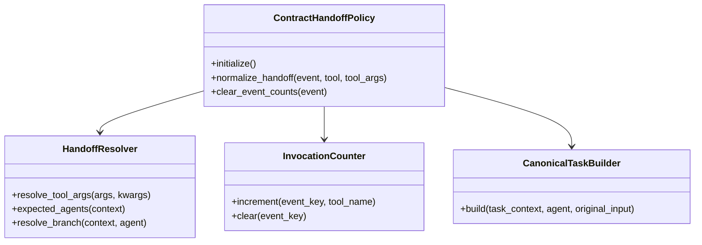
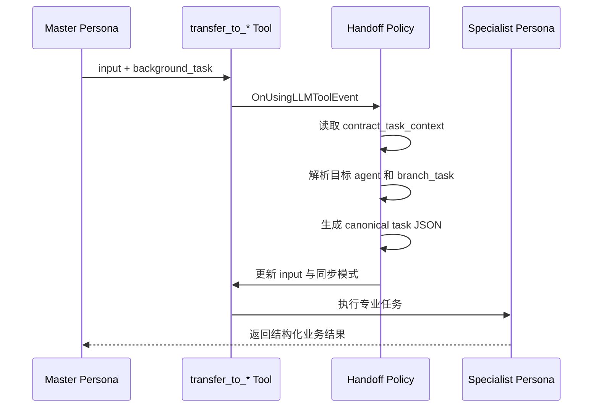
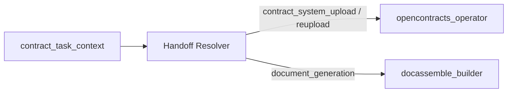

# 合同子代理委派策略 0.4.3

本插件把主人格发出的 `transfer_to_*` 调用规范化为专业子助手可执行的合同任务，并维持企业微信当前事件内的同步交付。

## 职责

- 根据 `contract_task_context.recommended_subagents` 解析目标子助手。
- 将主人格备注与结构化任务上下文合并。
- 为目标子助手提取 `branch_task`、`operation`、`required_tools` 和 `expected_outputs`。
- 在企业微信平台和 `current_event_response` 模式下设置同步执行。
- 记录当前事件中每个子助手的调用次数，并在消息发送完成后清理计数。
- 在规范化任务中声明读取通道、写入通道和 receipt 角色。

## 组件 UML



## 委派时序



## 路由映射



当前映射：

```text
opencontracts_operator -> transfer_to_opencontracts_operator
docassemble_builder   -> transfer_to_docassemble_builder
```

## 规范化任务结构

专业子助手接收的 JSON 以 Router 上下文为基础，并增加：

```text
delegated_agent
branch_task
operation
required_tools
expected_outputs
remaining_expected_subagents
main_agent_note
document_read_channel = opencontracts_mcp
document_write_channel = worker_key_document_import
receipt_role = upload_audit
```

Handoff Policy 传递任务契约。MCP 读取、WorkerKey 导入和结果核验由 OpenContracts Operator 及其工具完成。
