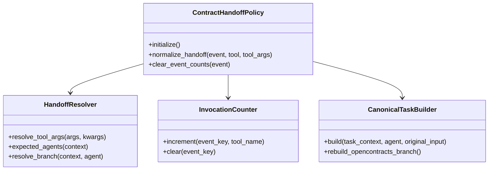
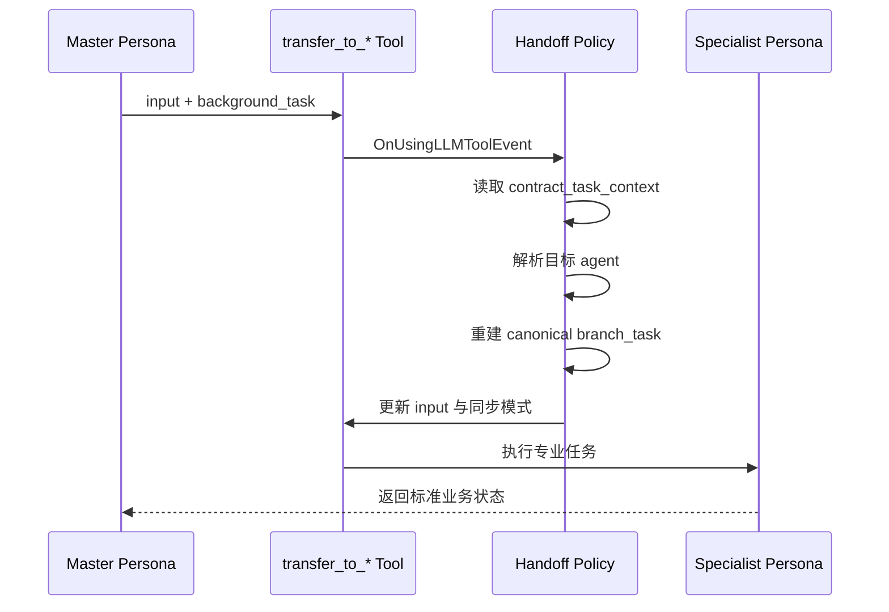

# 合同子代理委派策略 0.4.5

本插件把主人格发出的 `transfer_to_*` 调用规范化为专业子助手可执行的合同任务，并维持企业微信当前事件内的同步交付。

## 职责

- 根据 `contract_task_context.recommended_subagents` 解析目标子助手。
- 将主人格备注与结构化任务上下文合并。
- 在企业微信平台和 `current_event_response` 模式下设置同步执行。
- 记录当前事件中每个子助手的调用次数，并在消息发送完成后清理计数。
- 为 OpenContracts Operator 重建公开 MCP 任务契约，避免 Router 旧上下文泄漏到子人格。
- 从 `targets.opencontracts` 取得目标 `corpus_slug`。
- 声明公开 MCP 读取通道、WorkerKey 写入通道、身份契约、状态契约和安全约束。

## 公开 MCP 兼容边界

当前 Router 0.5.0 在 Phase 2-B 拆分前仍可能生成旧的 `branch_task.required_tools`。Handoff 不直接透传该列表，而是为 OpenContracts Operator 重建：

```text
list_documents
opencontracts_gateway_status
opencontracts_upload_document
get_document_text
search_corpus
```

同时生成：

```text
mcp_contract.endpoint = /mcp/
mcp_contract.corpus_slug = targets.opencontracts
branch_task.corpus_slug = targets.opencontracts
```

以下旧工具或回退行为被明确禁止：

```text
opencontracts_check_duplicate
get_corpus_info
list_public_corpuses 选择上传目标
Shell
Python
通用 HTTP
读取配置文件
直接 MCP JSON-RPC
探测其他 MCP URL
```

因此，即使 Router 上下文中残留旧工具名，OpenContracts Operator 接收的 `branch_task` 和顶层 `required_tools` 仍保持一致。

## 组件 UML



## 委派时序



## 路由映射

```text
opencontracts_operator -> transfer_to_opencontracts_operator
docassemble_builder   -> transfer_to_docassemble_builder
```

## OpenContracts 规范化任务结构

OpenContracts Operator 接收的 JSON 包含：

```text
delegated_agent
branch_task
operation
required_tools
expected_outputs
remaining_expected_subagents
contract_identity
targets.opencontracts
mcp_contract
document_read_channel = opencontracts_public_mcp
document_write_channel = worker_key_bound_document_import
receipt_role = append_only_upload_audit
identity_contract
status_contract
constraints
```

Handoff Policy 只负责形成确定性任务契约。公开 MCP 读取、WorkerKey 导入和结果核验由 OpenContracts Operator 及其标准工具完成。
