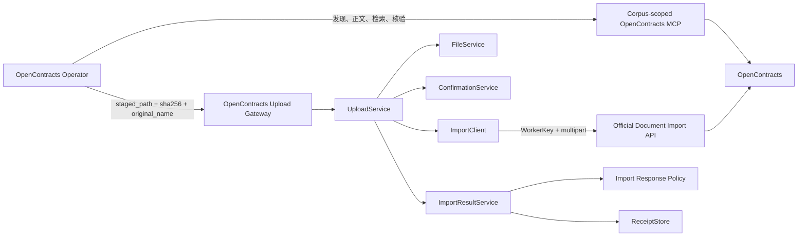
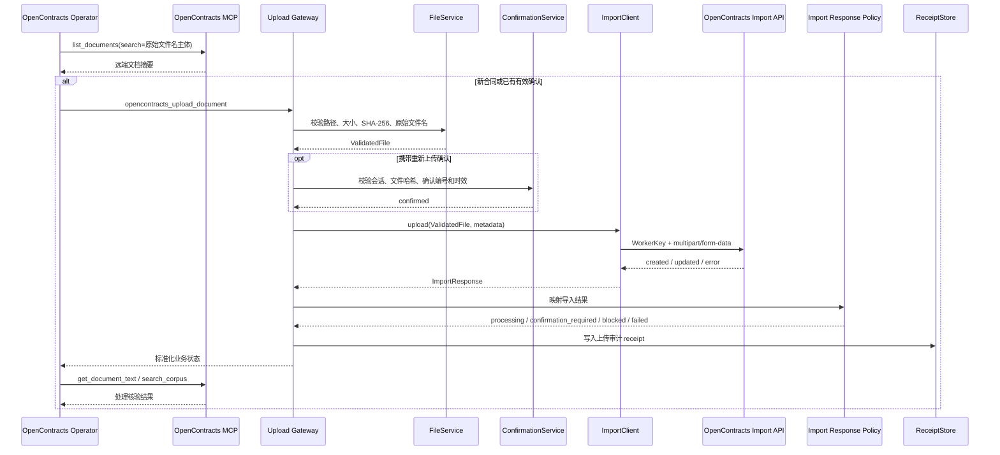
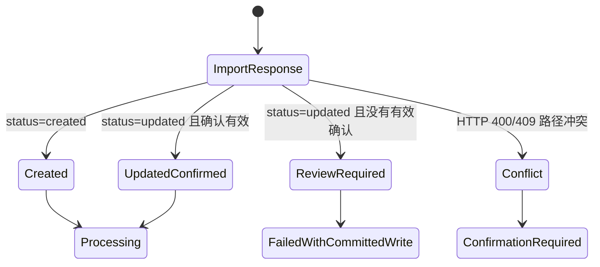

# OpenContracts 上传网关 0.6.0

本插件把 AstrBot 暂存合同写入 OpenContracts 官方文档导入端点，并保存上传审计记录。合同发现、正文读取、语义检索和处理核验由 OpenContracts Operator 使用 corpus-scoped OpenContracts MCP 完成。

## 职责

- 校验暂存路径、普通文件类型、文件大小和 SHA-256。
- 保留路由任务中的原始文件名。
- 验证路由器签发的重新上传确认编号。
- 使用 WorkerKey 调用 `/api/imports/documents/`。
- 标准化导入响应和异常版本写入。
- 保存 receipt，供审计、恢复和运行诊断使用。

## 集成 UML



## 上传时序



## 版本写入核验

OpenContracts 在同一路径导入新内容时会返回 `updated`。网关按任务中的确认状态解释该结果：



`ReviewRequired` 表示 OpenContracts 已建立新版本，但任务没有观察到有效的重新上传确认。网关会保存 receipt，并返回：

```text
failure_stage = unexpected_unconfirmed_update
write_committed = true
manual_review_required = true
```

该状态用于显式暴露读取判断与写入结果之间的竞态或身份判断偏差，避免把未确认的新版本写入当作普通成功。

## 模块结构

```text
astrbot_plugin_opencontracts_gateway/
├── main.py
├── config/
│   └── settings.py
├── domain/
│   ├── models.py
│   └── results.py
├── clients/
│   └── import_client.py
├── services/
│   ├── confirmation_service.py
│   ├── file_service.py
│   ├── import_response_policy.py
│   ├── import_result_service.py
│   └── upload_service.py
├── storage/
│   └── receipt_store.py
└── tests/
    ├── test_confirmation_service.py
    └── test_upload_service.py
```

`main.py` 负责 AstrBot 生命周期和 LLM Tool 注册。配置、文件验证、确认验证、HTTP 写入、响应策略和持久化分别位于独立模块。

## 配置

```text
base_url
WorkerKey（GUI 字段名 auth_token）
import_path = /api/imports/documents/
default_corpus_id
default_corpus_slug
allowed_roots
data_dir
router_state_path
max_file_bytes
timeout_seconds
confirmation_ttl_seconds
verify_tls
```

OpenContracts MCP 连接在 AstrBot MCP 管理界面配置。目标 corpus 为 `contracts` 时使用：

```text
http://opencontracts-api:8000/mcp/corpus/contracts/
```

插件配置只保存写入所需 WorkerKey。

## Tool 契约

### `opencontracts_gateway_status`

返回 WorkerKey 写入配置、官方导入端点、目标 corpus、允许目录和 receipt 数量。

### `opencontracts_upload_document`

输入：

```text
staged_path
expected_sha256
source_filename
title
description
custom_meta
duplicate_confirmation_id
```

输出状态：

```text
processing
confirmation_required
blocked
failed
```

`complete` 由 OpenContracts Operator 在 MCP 正文读取和语义检索核验完成后产生。

## Receipt

Receipt 记录文件哈希、原始文件名、OpenContracts 文档 ID、corpus、服务端导入状态、最近任务 ID、确认状态和人工核查标记。Receipt 是上传审计记录；远端合同发现和读取结果来自 MCP。
