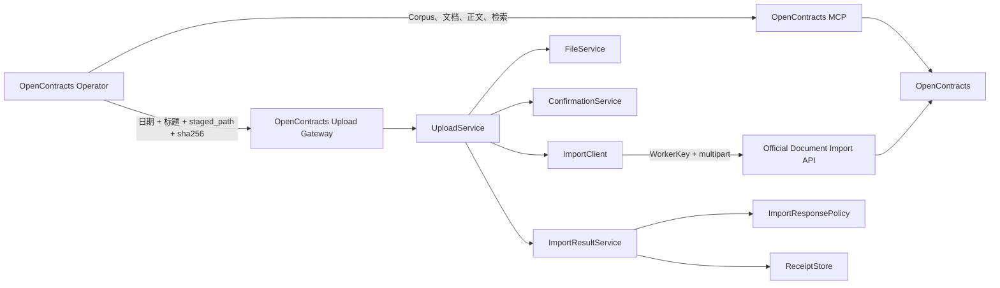
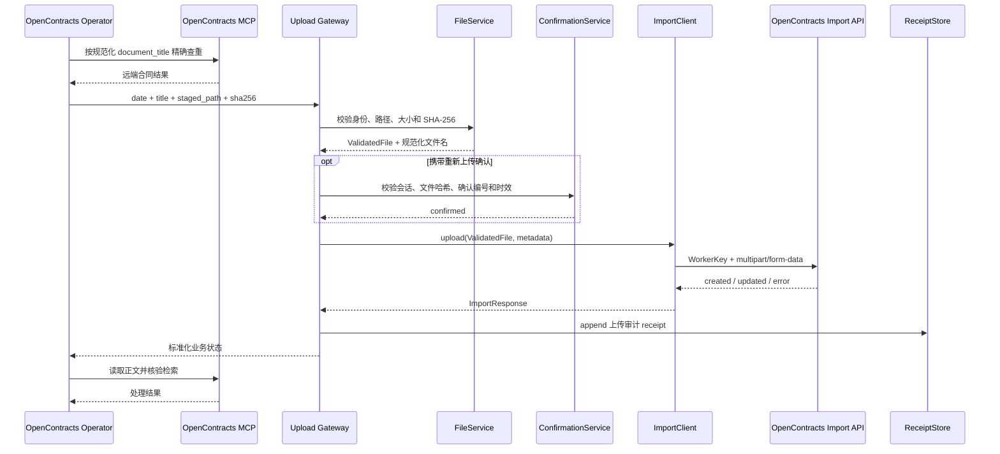
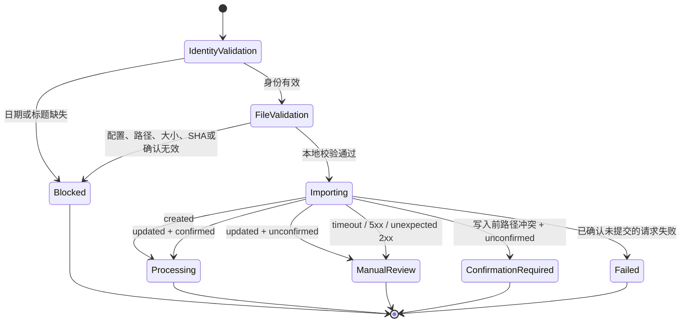

# OpenContracts 上传网关 0.6.1

本插件负责把 AstrBot 暂存合同写入 OpenContracts 官方文档导入端点，并保存追加式上传审计记录。

OpenContracts 合同库读取由 OpenContracts Operator 使用 MCP 完成。Gateway 只承担合同身份规范化、本地文件校验、重新上传确认校验和 WorkerKey 文件导入。

## 职责

- 校验暂存路径、普通文件类型、文件大小和 SHA-256。
- 要求合同日期和合同标题，生成稳定远端身份。
- 保留原始文件名及扩展名，远端文件名规范为 `YYYY-MM-DD_合同标题.原扩展名`。
- 远端文档标题规范为 `YYYY-MM-DD 合同标题`。
- 验证路由器签发的重新上传确认编号。
- 使用 WorkerKey 调用 `/api/imports/documents/`，写入目标由 WorkerKey 绑定。
- 标准化 `processing`、`confirmation_required`、`blocked`、`manual_review_required` 和 `failed`。
- 对传输异常、服务端 5xx、成功响应结构异常和未确认版本写入返回人工核查状态，禁止自动重试。
- 追加保存每次上传 receipt，供审计和运行诊断使用。

## 集成 UML



## 上传时序



## 状态图



## 模块结构

```text
astrbot_plugin_opencontracts_gateway/
├── main.py
├── config/settings.py
├── domain/models.py
├── domain/results.py
├── clients/import_client.py
├── services/confirmation_service.py
├── services/file_service.py
├── services/import_response_policy.py
├── services/import_result_service.py
├── services/upload_service.py
└── storage/receipt_store.py
```

`main.py` 只负责 AstrBot 生命周期和两个 LLM Tool 的注册。配置、验证、HTTP 写入、响应策略和持久化分别位于独立模块。

## OpenContracts MCP

建议在 AstrBot MCP 管理界面配置 corpus-scoped MCP：

```text
http://opencontracts-api:8000/mcp/corpus/contracts/
```

上传流程至少需要：

```text
get_corpus_info
list_documents
get_document_text
search_corpus
```

Gateway 不代理 MCP 工具，也不保存 MCP 读取凭证。当前 MCP 连接必须指向 WorkerKey 所绑定的业务 Corpus；写入后通过 MCP 结果核验实际落库状态。

## 配置

```text
base_url
WorkerKey（GUI 字段名 auth_token）
import_path = /api/imports/documents/
default_make_public
allowed_roots
data_dir
router_state_path
require_expected_sha256
max_file_bytes
timeout_seconds
confirmation_ttl_seconds
verify_tls
```

Gateway 不要求或显示配置 Corpus ID。WorkerKey 的 Corpus 绑定决定写入目标。

## Tool 契约

### `opencontracts_gateway_status`

返回 WorkerKey 是否配置、官方导入端点、允许目录和追加式 receipt 数量。

### `opencontracts_upload_document`

输入：

```text
staged_path
expected_sha256
contract_date
contract_title
source_filename
description
custom_meta
duplicate_confirmation_id
```

其中：

```text
document_title = YYYY-MM-DD 合同标题
normalized_filename = YYYY-MM-DD_合同标题.原扩展名
```

输出状态：

```text
processing
confirmation_required
blocked
manual_review_required
failed
```

`complete` 由 OpenContracts Operator 根据 MCP 正文读取和检索结果产生。

## Receipt

Receipt 采用 append-only 记录，每次写入形成独立记录，包括：

- receipt ID 和记录时间；
- 原始文件名、规范化文件名和 SHA-256；
- 合同日期、合同标题和远端文档标题；
- OpenContracts 文档 ID 和服务端导入状态；
- 任务 ID、确认状态和 HTTP 状态；
- `write_committed`、`manual_review_required` 和 failure stage。

Receipt 只用于上传审计，不能作为远端合同存在或不存在的依据。

## MVP 验证

```bash
python3 -m compileall -q plugins scripts
python scripts/build_release.py --clean
```

随后在 AstrBot WebUI 中加载插件、Skills 和 Persona，并验证首次上传、重复确认、人工核查和正文/检索状态。当前阶段不新增测试目录。
