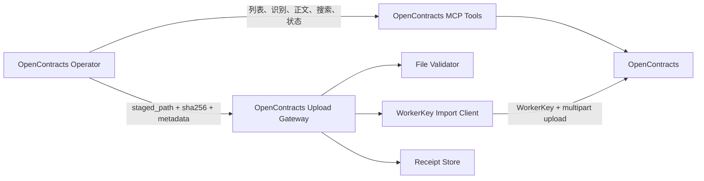
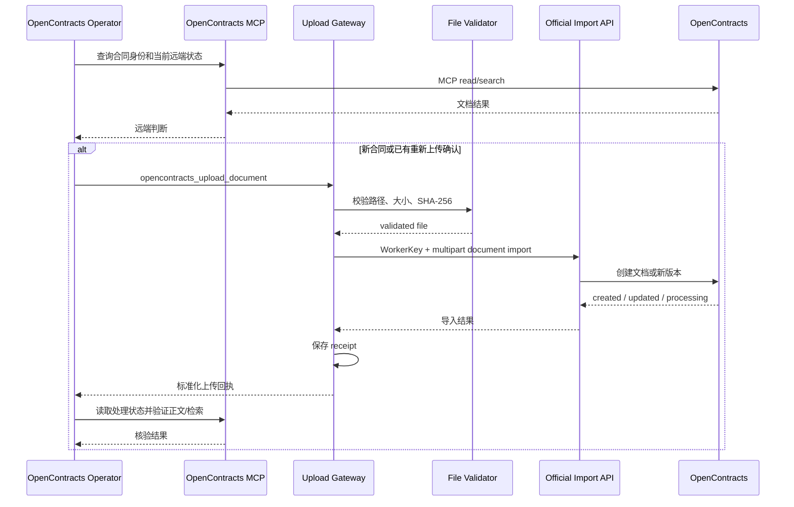

# OpenContracts Gateway 0.5.1

本插件承担 AstrBot 暂存文件到 OpenContracts 官方导入接口的写入适配，并保存上传回执。

本次仅完善架构文档，插件版本保持 `0.5.1`。当前 `main.py` 仍包含 REST 路径查询代码；Phase 2 会按本 README 中冻结的职责进行重构。

## 目标职责

- 使用 WorkerKey 调用 OpenContracts 官方文档导入接口。
- 校验暂存文件路径、文件大小和任务上下文 SHA-256。
- 传递原始文件名、标题、Corpus 和业务元数据。
- 标准化 `created`、`updated`、`processing` 和失败状态。
- 保存本地上传回执，为审计、恢复和历史文件名解析提供线索。

合同列表、合同身份解析、正文读取、搜索和处理状态核验由 OpenContracts Operator 调用 OpenContracts MCP Tools 完成。

## OpenContracts 集成 UML



### 能力分配

| 能力 | 组件 |
|---|---|
| 远端合同列表和识别 | OpenContracts MCP |
| 合同正文和语义搜索 | OpenContracts MCP |
| 上传后的处理状态核验 | OpenContracts MCP |
| 本地暂存文件校验 | Gateway File Validator |
| 新合同上传和版本化重新上传 | Gateway WorkerKey Import Client |
| 上传回执和历史文件名线索 | Gateway Receipt Store |

## 上传时序



## 当前实现与 Phase 2 目标

当前 `0.5.1` 的 `main.py` 同时包含：

- `/api/imports/documents/lookup/` REST 查询；
- WorkerKey 上传；
- receipt 存储；
- 文件校验；
- 重复确认绑定；
- 结果标准化。

Phase 2 将把读取与重复判断迁移到 OpenContracts MCP 调用链，并把 Gateway 拆为上传写入相关模块：

```text
astrbot_plugin_opencontracts_gateway/
├── main.py
├── domain/
│   ├── upload_command.py
│   └── upload_result.py
├── clients/
│   └── import_client.py
├── services/
│   ├── file_validation_service.py
│   ├── upload_service.py
│   └── confirmation_service.py
├── storage/
│   └── receipt_store.py
└── config/
    └── settings.py
```

## 配置模型

Gateway 写入配置以 WorkerKey 为核心：

```text
base_url
auth_mode = worker_key
auth_token = <WorkerKey>
default_corpus_id
default_corpus_slug
allowed_roots
data_dir
router_state_path
max_file_bytes
timeout_seconds
confirmation_ttl_seconds
verify_tls
```

OpenContracts MCP 连接由 AstrBot MCP 管理界面配置。Gateway 配置不承载独立的读取凭证。

## Tool 契约

### `opencontracts_gateway_status`

返回上传写入配置、目标 Corpus、允许目录和 receipt 概况。

### `opencontracts_upload_document`

输入：

```text
staged_path
expected_sha256
source_filename
title
description
custom_meta
duplicate_confirmation_id
```

输出使用稳定业务状态：

```text
processing
confirmation_required
blocked
failed
complete（仅在后续 MCP 核验完成后由操作流程产生）
```

`source_filename` 来自 Router 的 `source_files[].original_name`；`staged_path` 只用于读取本地文件。
