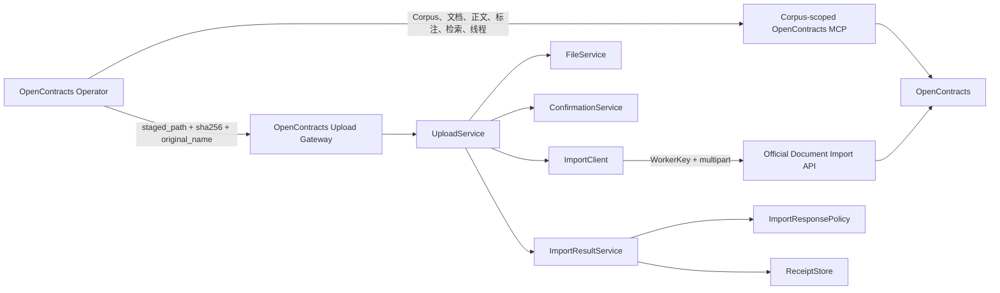
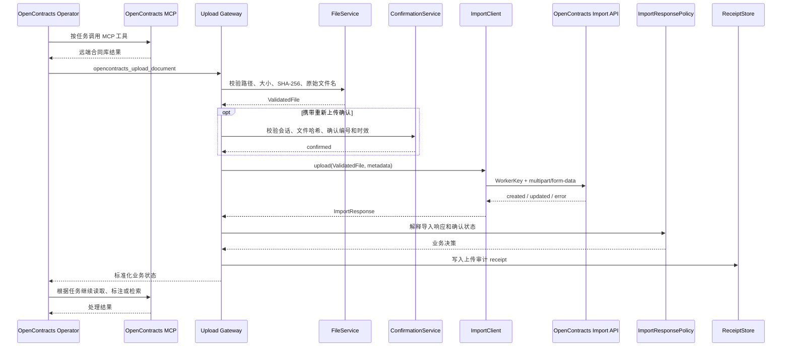
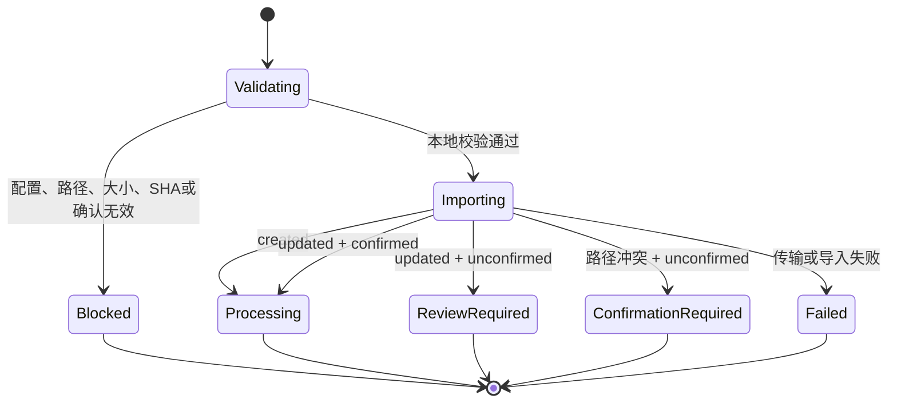

# OpenContracts 上传网关 0.6.0

本插件负责把 AstrBot 暂存合同写入 OpenContracts 官方文档导入端点，并保存上传审计记录。

OpenContracts 合同库操作由 OpenContracts Operator 使用 MCP 完成。官方 `docs/mcp/` 和运行时工具发现是 MCP 能力的事实来源；Gateway 只承担 WorkerKey 文件导入链路。

## 职责

- 校验暂存路径、普通文件类型、文件大小和 SHA-256。
- 保留路由任务中的原始文件名。
- 验证路由器签发的重新上传确认编号。
- 使用 WorkerKey 调用 `/api/imports/documents/`。
- 标准化 `created`、`updated`、`processing`、`confirmation_required`、`blocked` 和 `failed`。
- 保存上传 receipt，供审计和运行诊断使用。

## 集成 UML



## 上传时序



## 状态图



## 模块结构

```text
astrbot_plugin_opencontracts_gateway/
├── main.py
├── config/
│   └── settings.py
├── domain/
│   ├── models.py
│   └── results.py
├── clients/
│   └── import_client.py
├── services/
│   ├── confirmation_service.py
│   ├── file_service.py
│   ├── import_response_policy.py
│   ├── import_result_service.py
│   └── upload_service.py
└── storage/
    └── receipt_store.py
```

`main.py` 只负责 AstrBot 生命周期和两个 LLM Tool 的注册。配置、验证、HTTP 写入、响应策略和持久化分别位于独立模块。

## OpenContracts MCP 能力

建议在 AstrBot MCP 管理界面配置：

```text
http://opencontracts-api:8000/mcp/corpus/contracts/
```

当前 scoped MCP 工具包括：

```text
get_corpus_info
list_documents
get_document_text
list_annotations
search_corpus
list_threads
get_thread_messages
```

Gateway 不代理这些工具，也不保存 MCP 读取凭证。

## 配置

```text
base_url
WorkerKey（GUI 字段名 auth_token）
import_path = /api/imports/documents/
default_corpus_id
default_corpus_slug
allowed_roots
data_dir
router_state_path
max_file_bytes
timeout_seconds
confirmation_ttl_seconds
verify_tls
```

## Tool 契约

### `opencontracts_gateway_status`

返回 WorkerKey 写入配置、官方导入端点、目标 corpus、允许目录和审计 receipt 数量。

### `opencontracts_upload_document`

输入：

```text
staged_path
expected_sha256
source_filename
title
description
custom_meta
duplicate_confirmation_id
```

输出状态：

```text
processing
confirmation_required
blocked
failed
```

`complete` 由 OpenContracts Operator 根据 MCP 读取和检索结果产生。

## Receipt

Receipt 记录：

- 原始文件 SHA-256；
- 原始文件名；
- OpenContracts 文档 ID；
- corpus 标识；
- 服务端导入状态；
- 最近任务 ID；
- 是否使用客户确认；
- 是否需要人工核查。

Receipt 的角色是上传审计。远端合同数据来自 MCP。

## MVP 验证

```bash
python3 -m compileall -q plugins scripts
```

随后使用发布脚本打包，在 AstrBot WebUI 中加载插件，并执行一次最小合同上传流程。当前阶段不维护单元测试目录。
