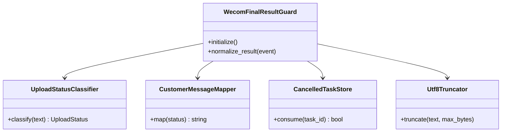
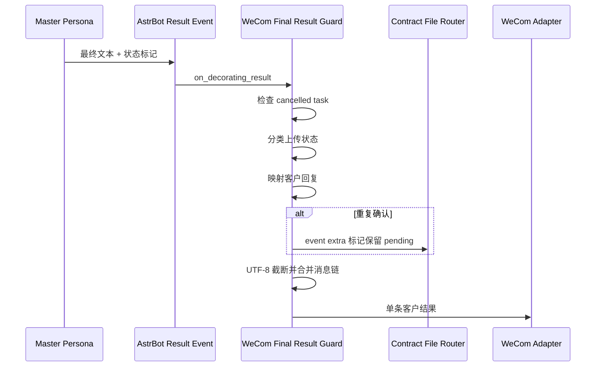
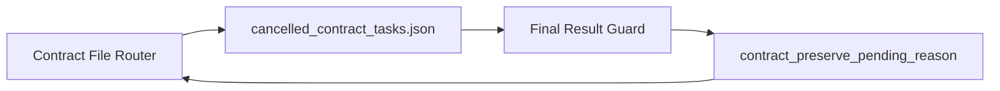

# 企业微信最终结果保护 0.3.2

本插件位于 AstrBot 结果装饰阶段，将合同内部状态转换为一条适合企业微信客服发送的客户回复。

## 职责

- 读取最终 `MessageEventResult` 并收集 Plain 与非文本组件。
- 按优先级识别合同上传状态标记，其中人工核查优先于普通处理中。
- 将内部状态转换为稳定的客户语言。
- 在重复确认场景设置 `contract_preserve_pending_reason`。
- 抑制客户已结束任务产生的迟到结果。
- 以 UTF-8 字节数控制企业微信文本长度。
- 保留有限数量的文件或图片组件。

## 组件 UML



当前实现仍集中在 `main.py`。图中的辅助组件是后续 Phase 2-C 拆分目标。

## 结果处理时序



## 状态映射

```text
[CONTRACT_UPLOAD:MANUAL_REVIEW]
[CONTRACT_UPLOAD:DUPLICATE_CONFIRMATION_REQUIRED]
[CONTRACT_UPLOAD:BLOCKED]
[CONTRACT_UPLOAD:PROCESSING]
[CONTRACT_UPLOAD:COMPLETE]
[CONTRACT_UPLOAD:FAILED]
```

状态优先级保证包含人工核查信号的混合输出不会被误判为普通处理中。

客户文案语义：

- `MANUAL_REVIEW`：写入可能已经发生，工作人员核查前不要重复上传；
- `DUPLICATE_CONFIRMATION_REQUIRED`：保留当前任务，等待重新上传或取消；
- `BLOCKED`：未执行写入，本次任务结束；管理员检查公开 MCP、目标 Corpus slug 和工具绑定后，客户重新上传文件；
- `PROCESSING`：写入已接收，但正文或检索尚未完成；
- `COMPLETE`：正文可读并已进入检索；
- `FAILED`：已确认没有提交，本次任务结束，修复后重新上传文件。

当前不提供 `BLOCKED` 或 `FAILED` 后的失败重试状态。除重复确认外，Router 会在最终结果发送后清理暂存文件。

## 与 Router 的共享状态



## 后续拆分目标

```text
astrbot_plugin_wecom_final_result_guard/
├── main.py
├── classification/
│   └── upload_status_classifier.py
├── mapping/
│   └── customer_message_mapper.py
├── storage/
│   └── cancelled_task_store.py
└── text/
    └── utf8_truncator.py
```
