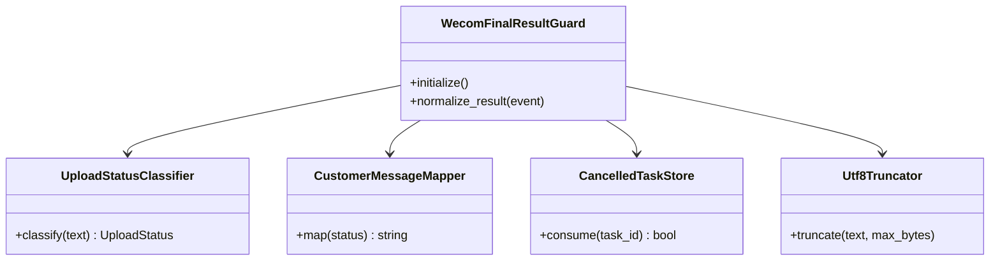
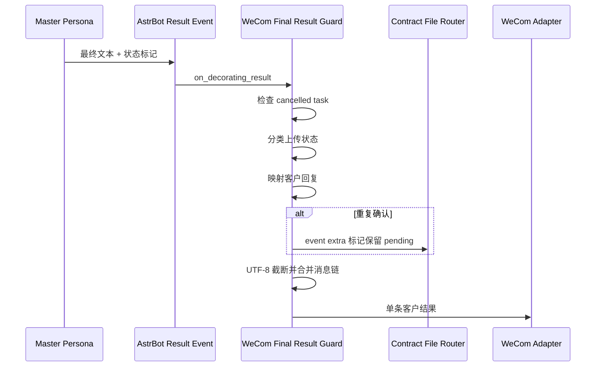
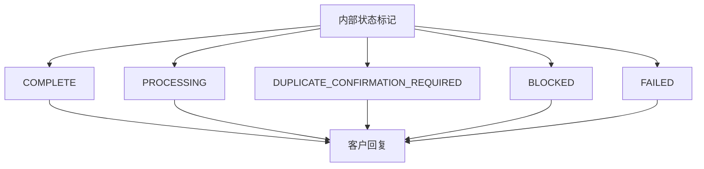
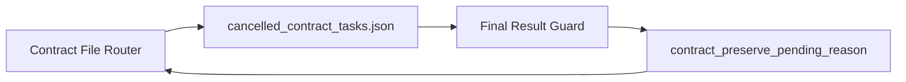

# 企业微信最终结果保护 0.2.3

本插件位于 AstrBot 结果装饰阶段，将合同内部状态转换为一条适合企业微信客服发送的客户回复。

本次仅完善架构文档，插件版本保持 `0.2.3`。

## 职责

- 读取最终 `MessageEventResult` 并收集 Plain 与非文本组件。
- 识别合同上传状态标记。
- 将内部状态转换为稳定的客户语言。
- 在重复确认场景设置 `contract_preserve_pending_reason`。
- 抑制客户已结束任务产生的迟到结果。
- 以 UTF-8 字节数控制企业微信文本长度。
- 保留有限数量的文件或图片组件。

插件接收的是统一业务状态。OpenContracts 读取方式、上传方式和子助手内部报告由上游组件处理。

## 组件 UML



当前实现仍集中在 `main.py`。图中的辅助组件是 Phase 2 拆分目标。

## 结果处理时序



## 状态映射



上游稳定标记：

```text
[CONTRACT_UPLOAD:COMPLETE]
[CONTRACT_UPLOAD:PROCESSING]
[CONTRACT_UPLOAD:DUPLICATE_CONFIRMATION_REQUIRED]
[CONTRACT_UPLOAD:BLOCKED]
[CONTRACT_UPLOAD:FAILED]
```

Phase 2 会优先依据这些标记分类，并逐步减少对 REST 错误文本、数据库约束文本和自然语言片段的兼容识别。

## 与 Router 的共享状态



- Router 登记已结束但仍可能返回结果的任务。
- Guard 消费登记并清空迟到结果。
- Guard 在重复确认时写入事件扩展字段。
- Router 在消息发送完成后根据该字段保留 pending 文件。

## Phase 2 拆分目标

```text
astrbot_plugin_wecom_final_result_guard/
├── main.py
├── classification/
│   └── upload_status_classifier.py
├── mapping/
│   └── customer_message_mapper.py
├── storage/
│   └── cancelled_task_store.py
└── text/
    └── utf8_truncator.py
```
