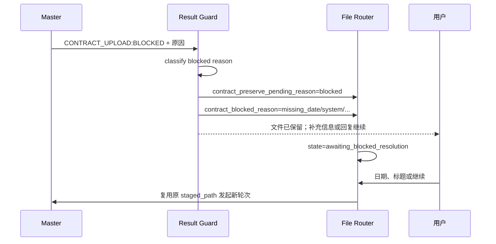

# 企业微信最终结果保护 0.3.4

本插件位于 AstrBot 结果装饰阶段，将合同内部状态转换为一条适合企业微信客服发送的客户回复，并向 Router 提供会话保留信号。

## 职责

- 按优先级识别合同上传状态标记；
- 将内部结果转换为稳定的客户语言；
- 对 `BLOCKED` 区分日期缺失、标题缺失、身份同时缺失和系统阻断；
- 为 `BLOCKED` 和重复确认设置 `contract_preserve_pending_reason`；
- 抑制已结束任务产生的迟到结果；
- 控制企业微信文本 UTF-8 字节长度并保留有限非文本组件。

## 状态映射

```text
[CONTRACT_UPLOAD:MANUAL_REVIEW]
[CONTRACT_UPLOAD:DUPLICATE_CONFIRMATION_REQUIRED]
[CONTRACT_UPLOAD:BLOCKED]
[CONTRACT_UPLOAD:PROCESSING]
[CONTRACT_UPLOAD:COMPLETE]
[CONTRACT_UPLOAD:FAILED]
```

客户文案语义：

- `MANUAL_REVIEW`：写入可能已经发生，工作人员核查前禁止重复上传；
- `DUPLICATE_CONFIRMATION_REQUIRED`：保留当前文件，等待重新上传或取消；
- `BLOCKED / missing_date`：保留当前文件，提示客户直接回复日期；
- `BLOCKED / missing_title`：保留当前文件，提示客户直接回复正式标题；
- `BLOCKED / missing_identity`：保留当前文件，提示补充日期和标题；
- `BLOCKED / system`：保留当前文件，管理员修复后客户回复“继续”；
- `PROCESSING`：写入已接收，但正文或检索尚未完成；
- `COMPLETE`：正文可读并已进入检索；
- `FAILED`：已确认没有提交且当前流程结束，后续需要重新上传。

## 与 Router 的事件契约



共享字段：

```text
contract_preserve_pending_reason = duplicate_confirmation_required
contract_preserve_pending_reason = blocked
contract_blocked_reason = missing_date | missing_title | missing_identity | system
```

Result Guard 不直接修改 Router 的 JSON 状态文件。Router 在消息发送完成后读取 event extra 并执行状态转换。

## 状态边界

- `BLOCKED`：当前轮次停止但任务保留，不清理文件；
- `DUPLICATE_CONFIRMATION_REQUIRED`：任务保留；
- `PROCESSING`、`COMPLETE`、`MANUAL_REVIEW`、`FAILED`：不设置保留标记，由 Router 结束普通暂存任务；
- 客户明确“结束/取消”时由 Router 删除保留文件。

## 后续拆分目标

```text
astrbot_plugin_wecom_final_result_guard/
├── main.py
├── classification/
├── mapping/
├── storage/
└── text/
```
